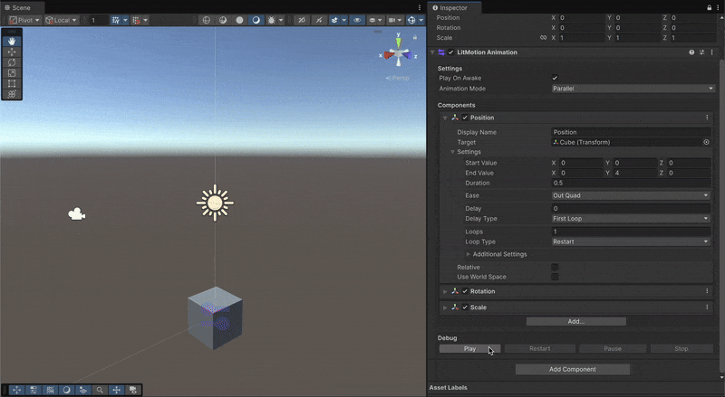

# LitMotion

Lightning-fast and Zero Allocation Tween Library for Unity.


[](LICENSE)

[日本語版READMEはこちら](README_JA.md)

## Overview

LitMotion is a high-performance tween library for Unity. LitMotion includes a rich set of features for animating components such as Transform, Material, TextMeshPro, and any field/property, making it easy to create animations.

LitMotion is my second tween library I created after [Magic Tween](https://github.com/annulusgames/MagicTween). LitMotion was designed based on experience implementing Magic Tween to achieve rich functionality and extremely high performance. In all situations such as creating and updating tweens, it exhibits overwhelming performance that is 2 to 20 times faster than other tween libraries. Of course, there is no allocation at all when creating a tween.


Additionally, v2 introduces Sequence for combining multiple motions and the LitMotion.Animation package, which allows you to create tween animations directly from the Inspector. With these additions, LitMotion is now as powerful, if not more, than DOTween Pro or PrimeTween in terms of features.

## Documentation

The full version of documentation can be found [here](https://annulusgames.github.io/LitMotion/).

## Features

* Animate anything in one line of code.
* Achieves zero allocations with the struct-based design
* Extremely high-performance implementation optimized using DOTS (Data-Oriented Technology Stack)
* Works in both runtime and editor
* Supports complex settings like easing and looping
* Waits for completion using callbacks/coroutines
* Zero allocation text animationSupports TextMesh Pro / UI Toolkit
* Special motions like Punch, Shake, etc.
* Conversion to Observable using [UniRx](https://github.com/neuecc/UniRx) / [R3](https://github.com/Cysharp/R3)
* async/await support using [UniTask](https://github.com/Cysharp/UniTask)
* Type extension with `IMotionOptions` and `IMotionAdapter`
* Integration with the Inspector via `SerializableMotionSettings<T, TOptions>`
* Debugging API and LitMotion Debugger window
* Combine animations using `LSequence`
* Create complex animations directly from the Inspector with the [LitMotion.Animation](articles/en/litmotion-animation-overview.md) package

## Setup

### Requirements

* Unity 2021.3 or later
* Burst 1.6.0 or later
* Collection 1.5.1 or later
* Mathematics 1.0.0 or later

### Installation

1. Open Package Manager from Window > Package Manager.
2. Click the "+" button > Add package from git URL.
3. Enter the following URL:

```
https://github.com/annulusgames/LitMotion.git?path=src/LitMotion/Assets/LitMotion
```

Alternatively, open Packages/manifest.json and add the following to the dependencies block:

```json
{
    "dependencies": {
        "com.annulusgames.lit-motion": "https://github.com/annulusgames/LitMotion.git?path=src/LitMotion/Assets/LitMotion"
    }
}
```

## Getting Started

Using LitMotion allows easy animation of values such as Transform and Material. To create motion, use `LMotion.Create()`.

Here's a sample code. Refer to the documentation for more details.

```cs
using System;
using System.Threading;
using UnityEngine;
using R3; // R3
using Cysharp.Threading.Tasks; // UniTask
using LitMotion;
using LitMotion.Extensions;

public class Example : MonoBehaviour
{
    [SerializeField] Transform target1;
    [SerializeField] Transform target2;
    [SerializeField] TMP_Text tmpText;

    void Start()
    {
        LMotion.Create(Vector3.zero, Vector3.one, 2f) // Animate values from (0f, 0f, 0f) to (1f, 1f, 1f) over 2 seconds
            .BindToPosition(target1); // Bind to target1.position

        LMotion.Create(0f, 10f, 2f) // Animate from 0f to 10f over 2 seconds
            .WithEase(Ease.OutQuad) // Specify easing function
            .WithLoops(2, LoopType.Yoyo) // Specify loop count and type
            .WithDelay(0.2f) // Set delay
            .BindToUnityLogger(); // Bind to Debug.unityLogger and display values in Console on update

        var value = 0f;
        LMotion.Create(0f, 10f, 2f) // Animate from 0f to 10f over 2 seconds
            .WithScheduler(MotionScheduler.FixedUpdate) // Specify execution timing with Scheduler
            .WithOnComplete(() => Debug.Log("Complete!")) // Set a callback
            .WithCancelOnError() // Cancel motion if an exception occurs within Bind
            .Bind(x => value = x) // Bind to any variable, field, or property
            .AddTo(gameObject); // Cancel motion when the GameObject is destroyed
        
        LMotion.String.Create128Bytes("", "<color=red>Zero</color> Allocation <i>Text</i> Tween! <b>Foooooo!!</b>", 5f)
            .WithRichText() // Enable RichText tags
            .WithScrambleChars(ScrambleMode.All) // Fill unseen parts with random characters
            .BindToText(tmpText); // Bind to TMP_Text (update text with zero allocation without generating strings)

        LMotion.Punch.Create(0f, 5f, 2f) // Create a Punch motion (regular damping oscillation)
            .WithFrequency(20) // Specify oscillation count
            .WithDampingRatio(0f) // Specify damping ratio
            .BindToPositionX(target2); // Bind to transform.position.x

        // Control created motions via the `MotionHandle` struct
        var handle = LMotion.Create(0f, 1f, 2f).RunWithoutBinding();

        if (handle.IsActive()) // Returns true if the motion is playing
        {
            handle.Cancel(); // Cancel the motion
            handle.Complete(); // Complete the motion
        }
    }
    
    // Animate TMP_Text characters
    void TMPCharMotionExample()
    {
        // Get the number of characters from TMP_Text.textInfo.characterCount
        for (int i = 0; i < text.textInfo.characterCount; i++)
        {
            LMotion.Create(Color.white, Color.red, 1f)
                .WithDelay(i * 0.1f)
                .WithEase(Ease.OutQuad)
                .BindToTMPCharColor(text, i); // Bind to the i-th character

            LMotion.Punch.Create(Vector3.zero, Vector3.up * 30f, 1f)
                .WithDelay(i * 0.1f)
                .WithEase(Ease.OutQuad)
                .BindToTMPCharPosition(text, i);
        }
    }

    // Coroutine support
    IEnumerator CoroutineExample()
    {
        var handle = LMotion.Create(0f, 1f, 2f).BindToUnityLogger();
        yield return handle.ToYieldInteraction(); // Wait for completion in a coroutine
    }

    // async/await using UniTask
    async UniTask AsyncAwaitExample(CancellationToken cancellationToken)
    {
        var handle = LMotion.Create(0f, 1f, 2f).BindToUnityLogger();
        await handle; // Await MotionHandle directly
        await handle.ToUniTask(cancellationToken); // Await with passing CancellationToken
    }

    // Convert to Observable<T> using R3
    void RxExample()
    {
        LMotion.Create(0f, 1f, 2f)
            .ToObservable() // Create motion as Observable<T>
            .Where(x => x > 0.5f) // Utilize R3 operators
            .Select(x => x.ToString())
            .Subscribe(x =>
            {
                tmpText.text = x;
            })
            .AddTo(this);
    }
}
```

## Sequence

The Sequence feature is provided for combining multiple motions.

```cs
LSequence.Create()
    .Append(LMotion.Create(0f, 1f, 1f).BindToPositionX(transform))
    .Join(LMotion.Create(0f, 1f, 1f).BindToPositionY(transform))
    .Insert(0f, LMotion.Create(0f, 1f, 1f).BindToPositionZ(transform))
    .Run();
```

For more details, refer to the [Sequence](https://annulusgames.github.io/LitMotion/articles/en/sequence.html) section in the documentation.

## LitMotion.Animation

LitMotion.Animation is an additional package that provides animation functionality built with LitMotion. 

By introducing this package, you can use the LitMotion Animation component to construct animations in the Inspector.




### Requirements

* Unity 2021.3 or later
* LitMotion 2.0.0 or later

### Installation

You can install LitMotion using the Package Manager.

1. Open Package Manager by navigating to Window > Package Manager.
2. Click on the "+" button and select "Add package from git URL."
3. Enter the following URL:

```text
https://github.com/annulusgames/LitMotion.git?path=src/LitMotion/Assets/LitMotion.Animation
```

Alternatively, you can open the `Packages/manifest.json` file and add the following line within the `dependencies` block:

```json
{
    "dependencies": {
        "com.annulusgames.lit-motion.animation": "https://github.com/annulusgames/LitMotion.git?path=src/LitMotion/Assets/LitMotion.Animation"
    }
}
```

### How to Use

For how to use LitMotion.Animation, please refer to the documentation on [LitMotion.Animation](https://annulusgames.github.io/LitMotion/articles/en/litmotion-animation-overview.html).

## Performance

Here are the benchmark results. The benchmark source code can be found in [this repository](https://github.com/annulusgames/TweenPerformance).

### Tween 64,000 float properties

#### Startup


#### Update


### Tween 50,000 transform.position

#### Startup


#### Update


### GC Allocation (per position tween creation)


## Support

Untiy forum: https://forum.unity.com/threads/litmotion-lightning-fast-and-zero-allocation-tween-library.1530427/

## License

[MIT License](LICENSE)

