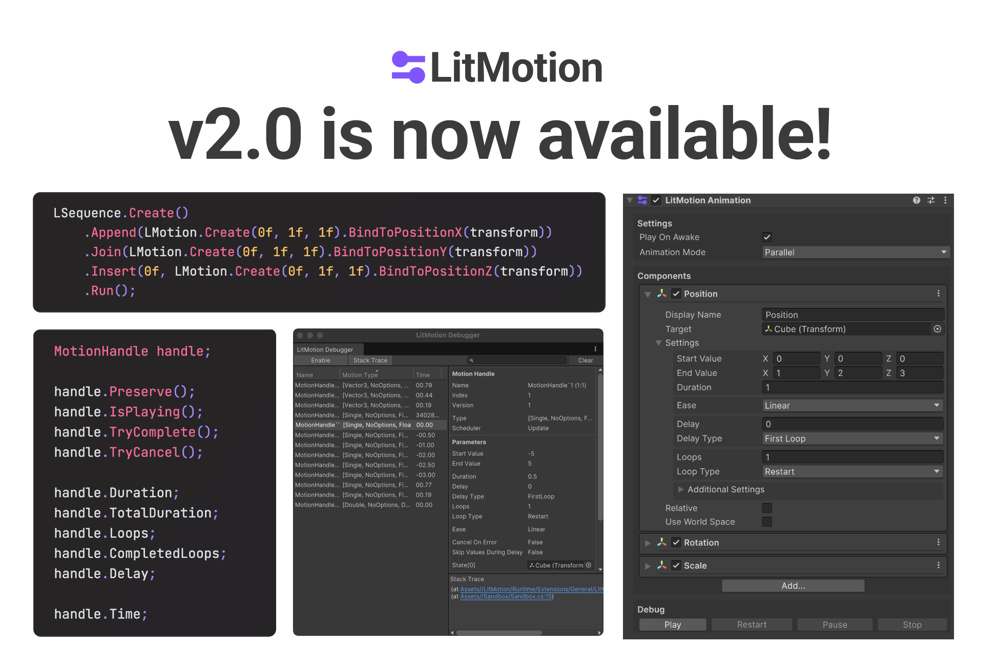

# LitMotion

Lightning-fast and Zero Allocation Tween Library for Unity.


[](LICENSE)

[English README is here.](README.md)

## 概要

LitMotionはUnity向けのハイパフォーマンスなトゥイーンライブラリです。LitMotionにはTransform、Material、TextMeshProなどのコンポーネントや独自のフィールド・プロパティをアニメーションさせるための豊富な機能が含まれており、簡単にアニメーションを作成できます。

LitMotionは[Magic Tween](https://github.com/AnnulusGames/MagicTween)に続いて私が作成した2つ目のトゥイーンライブラリです。LitMotionはMagic Tweenの実装で得た経験をもとに、必要十分な機能を厳選しつつ、最速で動作させることを念頭に置いて設計されました。トゥイーンの作成や駆動などあらゆるシチュエーションにおいて、他のトゥイーンライブラリと比較して2倍から20倍以上の圧倒的なパフォーマンスを発揮します。当然、トゥイーン作成時のアロケーションも一切ありません。



また、v2より複数のモーションを合成するためのSequenceと、Inspectorからトゥイーンアニメーションを作成可能なLitMotion.Animationパッケージが追加されました。これにより機能面においてもDOTween ProやPrimeTweenと同等または以上に強力なライブラリとなっています。

## ドキュメント

ドキュメントのフルバージョンは[こちら](https://annulusgames.github.io/LitMotion/)から確認できます。

## 特徴

* あらゆる値をコード一行でアニメーション可能
* 構造体ベースの設計でゼロアロケーションを達成
* DOTSを活用して最適化された極めてハイパフォーマンスな実装
* ランタイムとエディタの両方で動作
* イージングや繰り返しなど複雑な設定を適用可能
* コールバック/コルーチンによる完了の待機
* ゼロアロケーションなテキストアニメーション
* TextMesh Pro / UI Toolkitに対応
* Punch、Shakeなどの特殊なモーション
* UniRx/R3を利用したObservableへの変換
* UniTaskを利用したasync/await対応
* `IMotionOptions`と`IMotionAdapter`を用いた型の拡張
* `SerializableMotionSettings<T, TOptions>`によるInspectorとの統合
* デバッグ用のAPIおよびLitMotion Debuggerウィンドウ
* Sequenceによるアニメーションの合成
* Inspectorから複雑なアニメーションを作成可能なLitMotion.Animationパッケージ

## セットアップ

### 要件

* Unity 2021.3 以上
* Burst 1.6.0 以上
* Collection 1.5.1 以上
* Mathematics 1.0.0 以上

### インストール

1. Window > Package ManagerからPackage Managerを開く
2. 「+」ボタン > Add package from git URL
3. 以下のURLを入力する

```
https://github.com/AnnulusGames/LitMotion.git?path=src/LitMotion/Assets/LitMotion
```

あるいはPackages/manifest.jsonを開き、dependenciesブロックに以下を追記

```json
{
    "dependencies": {
        "com.annulusgames.lit-motion": "https://github.com/AnnulusGames/LitMotion.git?path=src/LitMotion/Assets/LitMotion"
    }
}
```

## スタートガイド

LitMotionを用いることでTransformやMaterialなどの値を簡単にアニメーションさせることができます。モーションを作成するには`LMotion.Create()`を使用します。

以下にコードのサンプルを示します。詳細についてはドキュメントを確認してください。

```cs
using System;
using System.Threading;
using UnityEngine;
using R3; // R3
using Cysharp.Threading.Tasks; // UniTask
using LitMotion;
using LitMotion.Extensions;

public class Example : MonoBehaviour
{
    [SerializeField] Transform target1;
    [SerializeField] Transform target2;
    [SerializeField] TMP_Text tmpText;

    void Start()
    {
        LMotion.Create(Vector3.zero, Vector3.one, 2f) // (0f, 0f, 0f)から(1f, 1f, 1f)まで2秒間で値をアニメーション
            .BindToPosition(target1); // target1.positionにバインドする

        LMotion.Create(0f, 10f, 2f) // 0fから10fまで2秒間でアニメーション
            .WithEase(Ease.OutQuad) // イージング関数を指定
            .WithLoops(2, LoopType.Yoyo) // ループ回数やループの形式を指定
            .WithDelay(0.2f) // 遅延を設定
            .BindToUnityLogger(); // Debug.unityLoggerにバインドし、更新時に値をConsoleに表示する

        var value = 0f;
        LMotion.Create(0f, 10f, 2f) // 0fから10fまで2秒間でアニメーション
            .WithScheduler(MotionScheduler.FixedUpdate) // 実行タイミングをSchedulerで指定
            .WithOnComplete(() => Debug.Log("Complete!")) // コールバックを設定
            .WithCancelOnError() // Bind内で例外が発生したらモーションをキャンセルする
            .Bind(x => value = x) // 任意の変数やフィールド、プロパティにバインド可能
            .AddTo(gameObject) // GameObjectが破棄された際にモーションをキャンセルする
        
        LMotion.String.Create128Bytes("", "<color=red>Zero</color> Allocation <i>Text</i> Tween! <b>Foooooo!!</b>", 5f)
            .WithRichText() // RichTextタグを有効化
            .WithScrambleChars(ScrambleMode.All) // 表示されていない部分をランダムな文字で埋める
            .BindToText(tmpText); // TMP_Textにバインド (stringを生成せずにゼロアロケーションでテキストを更新する)

        LMotion.Punch.Create(0f, 5f, 2f) // Punchモーション(規則的な減衰振動)を作成
            .WithFrequency(20) // 振動の回数を指定
            .WithDampingRatio(0f) // 減衰比を指定
            .BindToPositionX(target2); // transform.position.xにバインド

        // 作成したモーションの制御は`MotionHandle`構造体を介して行う
        var handle = LMotion.Create(0f, 1f, 2f).RunWithoutBinding();

        if (handle.IsActive()) // モーションが再生中の場合はtrueを返す
        {
            handle.Cancel(); // モーションをキャンセルする
            handle.Complete(); // モーションを完了する
        }
    }

    // TMP_Textの個別の文字をアニメーションさせる
    void TMPCharMotionExample()
    {
        // TMP_Text.textInfo.characterCountから文字数を取得
        for (int i = 0; i < text.textInfo.characterCount; i++)
        {
            LMotion.Create(Color.white, Color.red, 1f)
                .WithDelay(i * 0.1f)
                .WithEase(Ease.OutQuad)
                .BindToTMPCharColor(text, i); // i番目の文字にバインド
            
            LMotion.Punch.Create(Vector3.zero, Vector3.up * 30f, 1f)
                .WithDelay(i * 0.1f)
                .WithEase(Ease.OutQuad)
                .BindToTMPCharPosition(text, i);
        }
    }

    // コルーチンに対応
    IEnumerator CoroutineExample()
    {
        var handle = LMotion.Create(0f, 1f, 2f).BindToUnityLogger();
        yield return handle.ToYieldInteraction(); // コルーチンで完了を待機
    }

    // UniTaskを利用したasync/awaitに対応
    async UniTask AsyncAwaitExample(CancellationToken cancellationToken)
    {
        var handle = LMotion.Create(0f, 1f, 2f).BindToUnityLogger();
        await handle; // MotionHandleを直接await
        await handle.ToUniTask(cancellationToken); // ToUniTaskでCancellationTokenを渡してawait
    }

    // R3を利用したObservable<T>への変換に対応
    void RxExample()
    {
        LMotion.Create(0f, 1f, 2f)
            .ToObservable() // モーションをObservable<T>として作成
            .Where(x => x > 0.5f) // R3のオペレータを利用可能
            .Select(x => x.ToString())
            .Subscribe(x =>
            {
                tmpText.text = x;
            })
            .AddTo(this);
    }
}
```

## Sequence

複数のモーションを合成するための機能として、Sequenceが提供されています。

```cs
LSequence.Create()
    .Append(LMotion.Create(0f, 1f, 1f).BindToPositionX(transform))
    .Join(LMotion.Create(0f, 1f, 1f).BindToPositionY(transform))
    .Insert(0f, LMotion.Create(0f, 1f, 1f).BindToPositionZ(transform))
    .Run();
```

詳細はドキュメントの[Sequence](https://annulusgames.github.io/LitMotion/ja/sequence.html)を参照してください。

## LitMotion.Animation

LitMotion.AnimationはLitMotionで構築されたアニメーションの機能を提供する追加パッケージです。これを導入することで、Inspector上でアニメーションを構築できるLitMotion Animationコンポーネントが利用可能になります。


### 要件

* Unity 2021.3 以上
* LitMotion 2.0.0 以上

### インストール

1. Window > Package ManagerからPackage Managerを開く
2. 「+」ボタン > Add package from git URL
3. 以下のURLを入力

```text
https://github.com/AnnulusGames/LitMotion.git?path=src/LitMotion/Assets/LitMotion.Animation
```

あるいはPackages/manifest.jsonを開き、dependenciesブロックに以下を追記します。

```json
{
    "dependencies": {
        "com.annulusgames.lit-motion.animation": "https://github.com/AnnulusGames/LitMotion.git?path=src/LitMotion/Assets/LitMotion.Animation"
    }
}
```

### 使い方

LitMotion.Animationの使い方はドキュメントの[LitMotion.Animation](https://annulusgames.github.io/LitMotion/ja/litmotion-animation-overview.html)を参照してください。

## パフォーマンス

ベンチマークの結果を以下に示します。ベンチマークのソースコードは[こちらのリポジトリ](https://github.com/AnnulusGames/TweenPerformance)から確認可能です。

### Tween 64,000 float properties

#### Startup


#### Update


### Tween 50,000 transform.position

#### Startup


#### Update


### GC Allocation (per position tween creation)


## サポート

Untiy forum: https://forum.unity.com/threads/litmotion-lightning-fast-and-zero-allocation-tween-library.1530427/

## ライセンス

[MIT License](LICENSE)