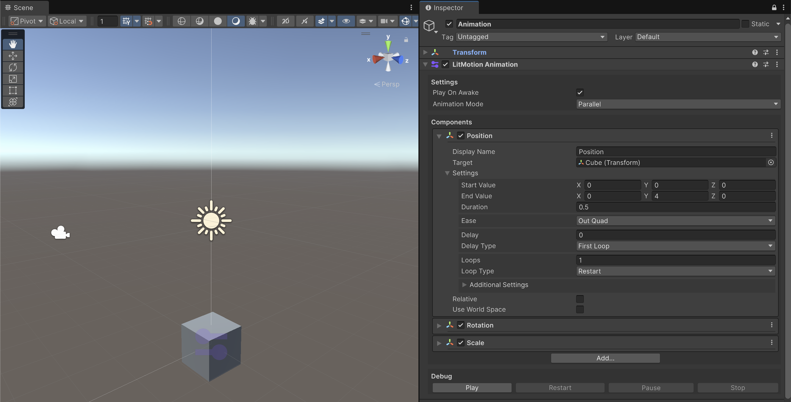
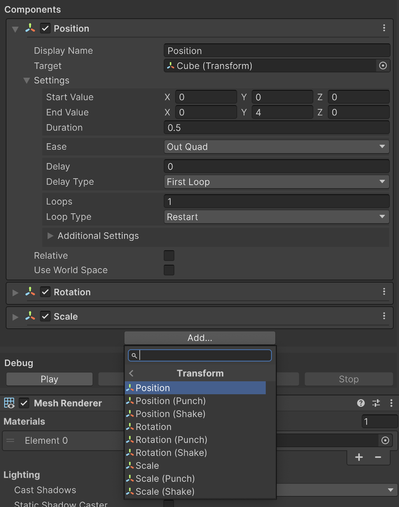

# LitMotion Animation

LitMotion Animation is a component for creating animations using LitMotion.

## Settings

#### Play On Awake

When set to true, the animation will automatically play on startup.

#### Animation Mode

Specifies how the animations set in the Components will be played. `Parallel` plays all animations simultaneously, while `Sequential` plays the animations in the order they appear.

## Components

In LitMotion Animation, you create animations by combining `Animation Components`.

Click the \[Add...\] button to add a new Animation Component.

Built-in Animation Components are provided for animating major Unity components, and you can also create your own custom Animation Components.

## Debug

This panel is used for previewing the animation playback. You can press the \[Play\] button to start the animation.

It works in both Edit Mode and Play Mode.
