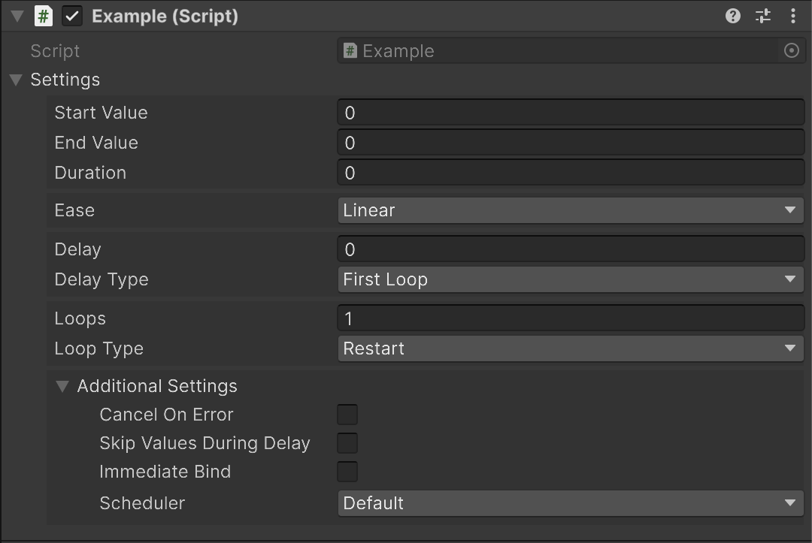

# MotionSettings

By using `MotionSettings<T, TOptions>`, you can store motion configuration settings for reuse.

`MotionSettings<T, TOptions>` can be created either using object initializers or via the `MotionBuilder`. The type arguments should be the type of the value to animate and the options type (such as `NoOptions`, `IntegerOptions`, `StringOptions`, `PunchOptions`, `ShakeOptions`, etc.).

```cs
// Created using an object initializer
var settings = new MotionSettings<float, NoOptions>
{
    StartValue = 0f,
    EndValue = 10f,
    Duration = 2f,
    Ease = Ease.OutQuad
};

// Created using MotionBuilder
var settings = LMotion.Create(0f, 10f, 2f)
    .WithEase(Ease.OutQuad)
    .ToMotionSettings();
```

The created `MotionSettings<T, TOptions>` can be passed as an argument to `LMotion.Create()`.

```cs
LMotion.Create(settings)
    .Bind(x => { });
```

Since `MotionSettings<T, TOptions>` is a record type, you can also overwrite part of the settings using the `with` expression.

```cs
var newSettings = settings with
{
    StartValue = 5f
};
```

## SerializableMotionSettings

Instead of using `MotionSettings<T, TOptions>`, you can use `SerializableMotionSettings<float, NoOptions>` to make the values editable in the Inspector.

```cs
public class Example : MonoBehaviour
{
    [SerializeField] SerializableMotionSettings<float, NoOptions> settings;

    void Start()
    {
        LMotion.Create(settings)
            .BindToPositionX(transform);
    }
}
```


