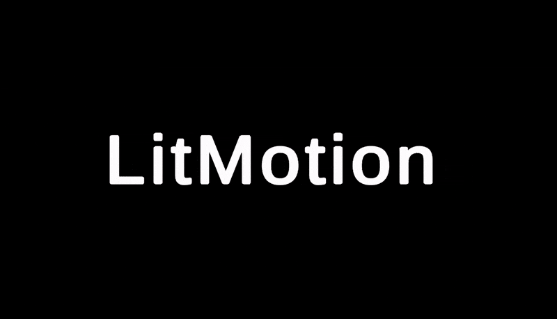

# TextMesh Pro Character Animation

In addition to the ability to animate text and values in TextMesh Pro, LitMotion provides the ability to animate specified characters.



```cs
TMP_Text text;
for (int i = 0; i < text.textInfo.characterCount; i++)
{
    LMotion.Create(Color.white, Color.red, 1f)
        .WithDelay(i * 0.1f)
        .WithEase(Ease.OutQuad)
        .BindToTMPCharColor(text, i);
    
    LMotion.Punch.Create(Vector3.zero, Vector3.up * 30f, 1f)
        .WithDelay(i * 0.1f)
        .WithEase(Ease.OutQuad)
        .BindToTMPCharPosition(text, i);
}
```

While manipulating characters with LitMotion, the character information is maintained even if the characters are rewritten during motion playback. However, after playback, it returns to the initial values through mesh updates (such as rewriting the text or calling `ForceMeshUpdate()`).