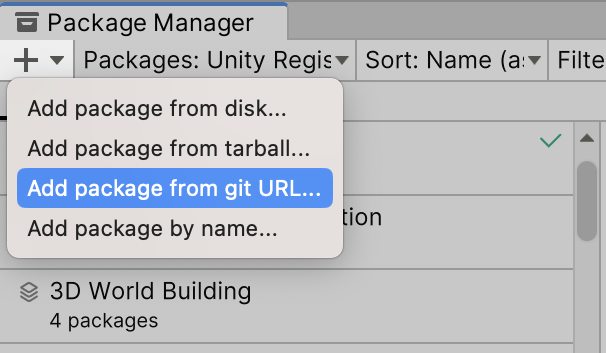

# インストール

プロジェクトにLitMotionをインストールして使用を開始しましょう。

### 要件

* Unity 2021.3 以上
* Burst 1.6.0 以上
* Collection 1.5.1 以上
* Mathematics 1.0.0 以上

### Package Manager経由でインストール (推奨)

Package Managerを利用してLitMotionをインストールできます。

1. Window > Package ManagerからPackage Managerを開く
2. 「+」ボタン > Add package from git URL
3. 以下のURLを入力

```text
https://github.com/AnnulusGames/LitMotion.git?path=/LitMotion/src/LitMotion/Assets/LitMotion
```



あるいはPackages/manifest.jsonを開き、dependenciesブロックに以下を追記します。

```json
{
    "dependencies": {
        "com.annulusgames.lit-motion": "https://github.com/AnnulusGames/LitMotion.git?path=/LitMotion/src/LitMotion/Assets/LitMotion"
    }
}
```

### unitypackageからインストール

配布されているunitypackageファイルからLitMotionをインストールすることも可能です。

1. Releasesから最新のリリースに移動
2. unitypackageファイルをダウンロード
3. ファイルを開き、プロジェクトにインポートする
