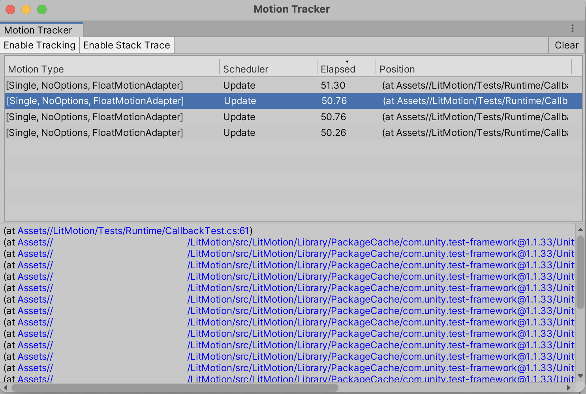

# Motion Tracker

Motion Tracker Windowを使用して作成したモーションを追跡することができます。

`Window > LitMotion > Motion Tracker`からウィンドウを開き、[Enable Tracking]を押してトラッキングを有効化します。

> [!WARNING]
> トラッキングを有効化している間はパフォーマンスが大きく低下します。そのため基本的には無効にしておき、デバッグ時にのみ有効化することを推奨します。