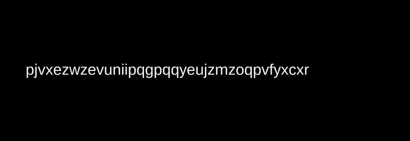

# テキストアニメーション

`LMotion.String.Create**Bytes()`を用いることで文字列をアニメーションさせるモーションを作成できます。

```cs
TMP_Text text;
LMotion.String.Create128Bytes("", "<color=red>Zero</color> Allocation <i>Text</i> Tween! <b>Foooooo!!</b>", 5f)
    .WithRichText()
    .WithScrambleChars(ScrambleMode.Lowercase)
    .BindToText(text);
```



LitMotionは`Unity.Collection`名前空間内にある固定長の文字列型`FixedString-`を使用します。そのため文字列のモーションを作成する際にはアニメーションさせる文字列の長さにあった関数を選択する必要があります

また、文字列をアニメーションさせる際は`BindToText()`を使用してTextMeshProのテキストにバインドすることが推奨されます。これは`TMP_Text`の`SetText()`を用いてバインドするため、完全にゼロアロケーションで文字列をアニメーションさせることが可能になります！

文字列のモーション専用の設定については[モーションの設定](motion-configuration.md)を参照してください。

### 数値型のモーションをTextにバインドする

数値のモーションをTextにバインドすることも可能です。こちらも`TMP_Text`が対象の場合は`BindToText()`を使用してゼロアロケーションでバインドを行うことができます。

```cs
TMP_Text text;
LMotion.Create(0, 999, 2f)
    .BindToText(text);
```

さらに、Format用の文字列を渡すことで書式の設定を行うことも可能です。以下はfloat型の数値をカンマ区切りで小数第二位まで表示するモーションのサンプルです。

```cs
TMP_Text text;
LMotion.Create(0f, 100000f, 2f)
    .BindToText(text, "{0:N2}");
```


ただし、これらのFormatを含むモーションは内部で`string.Format()`を使用するためGCアロケーションが発生します。これを回避するにはプロジェクトにZStringを導入する必要があります。詳細は[ZString](integration-zstring.md)の項目を参照してください。