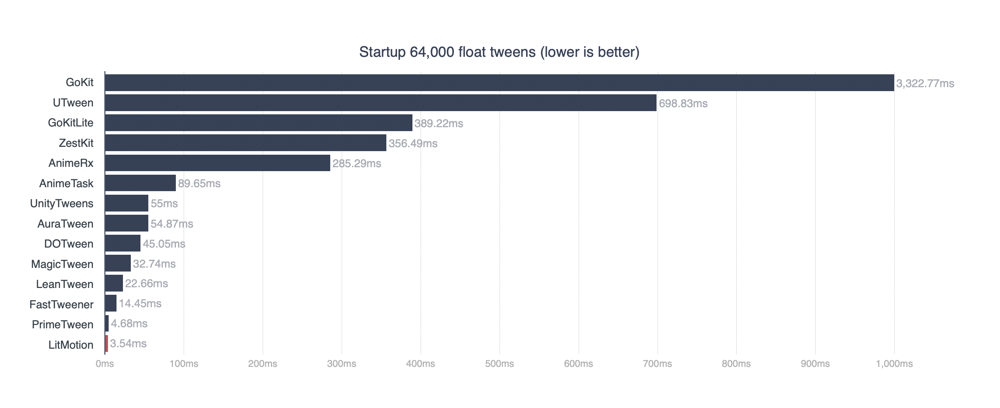
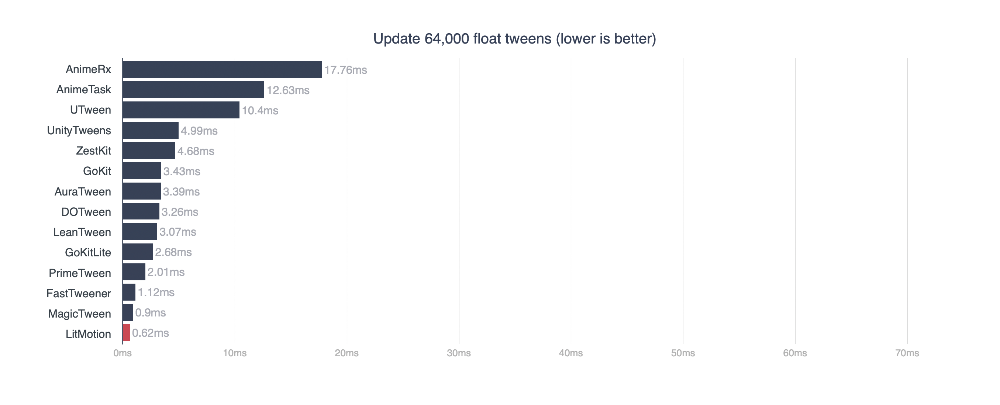
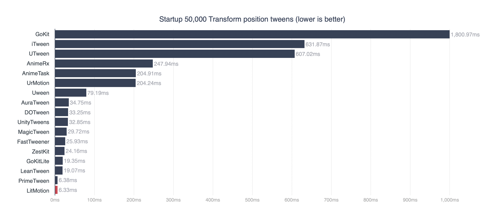
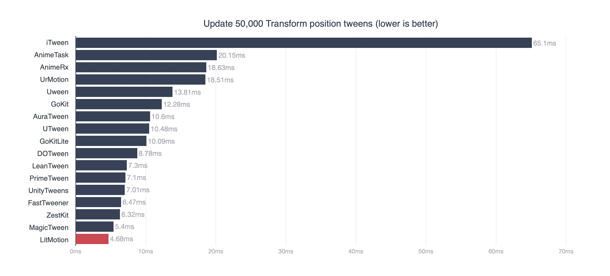
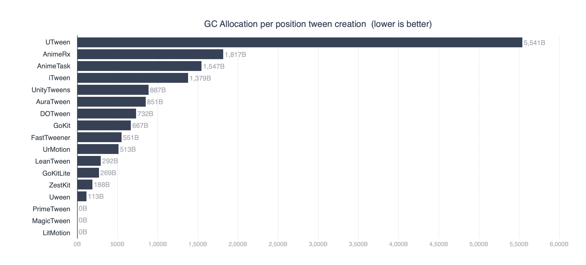

# LitMotion Overview

LitMotion is a high-performance tweening library for Unity. It encompasses a rich set of features to animate components like Transform, along with custom fields and properties, allowing for easy creation of animations.

The biggest feature of LitMotion is its excellent performance. Designed to take full advantage of Unity's latest technology, "DOTS", including the C# Job System and Burst Compiler, LitMotion runs 2-20 times (or more) faster than other tween libraries in various situations, such as creating and executing tweens. In addition, there are no allocations during tween creation.

Additionally, v2 introduces Sequence for combining multiple motions and the LitMotion.Animation package, which allows you to create tween animations directly from the Inspector. With these additions, LitMotion is now as powerful, if not more, than DOTween Pro or PrimeTween in terms of features.

## Features

* Animate anything in one line of code.
* Achieves zero allocations with the struct-based design
* Extremely high-performance implementation optimized using DOTS (Data-Oriented Technology Stack)
* Works in both runtime and editor
* Supports complex settings like easing and looping
* Waits for completion using callbacks/coroutines
* Zero allocation text animationSupports TextMesh Pro / UI Toolkit
* Special motions like Punch, Shake, etc.
* Conversion to Observable using [UniRx](https://github.com/neuecc/UniRx) / [R3](https://github.com/Cysharp/R3)
* async/await support using [UniTask](https://github.com/Cysharp/UniTask)
* Type extension with `IMotionOptions` and `IMotionAdapter`
* Integration with the Inspector via `SerializableMotionSettings<T, TOptions>`
* Debugging API and LitMotion Debugger window
* Combine animations using `LSequence`
* Create complex animations directly from the Inspector with the [LitMotion.Animation](articles/en/litmotion-animation-overview.md) package

### Performance

LitMotion operates faster than any Unity tweening library in both motion creation and execution. Below are the results of benchmarks.

---

---

---

---

The project and source code used for the benchmarks can be reviewed in [this repository](https://github.com/AnnulusGames/TweenPerformance).

### Comparison with DOTween/Magic Tween

Among other Unity tweening libraries like DOTween and the previously mentioned Magic Tween, LitMotion possesses distinct features in comparison.

* Excellent Performance
  - LitMotion operates about 5 times faster than DOTween.
  - It is about 1.5 times faster than the faster Magic Tween.
  - Additionally, there are no allocations during motion creation.
* Curated Features
  - While LitMotion provides sufficient features, it offers fewer functionalities compared to Magic Tween or DOTween. This approach aligns with the library's concept of being "Simple" (although room for extension is available).
* Simple and Flexible API
  - With a natural feel using method chaining, LitMotion enables smooth writing from motion creation to binding.
  - Unlike Magic Tween or DOTween, LitMotion does not include extension methods for components. While I acknowledge the advantages of extension methods, they can sometimes lead to confusion in terms of readability. LitMotion prioritizes API simplicity and unifies the entry point into the `LMotion` class.